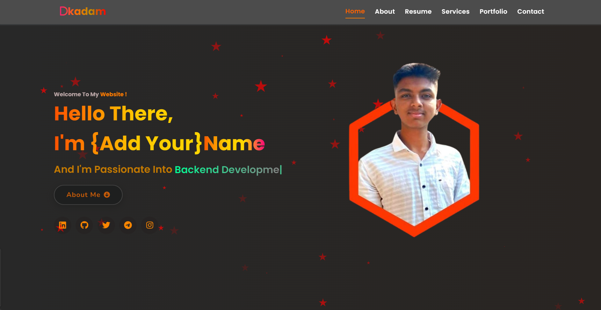

# Portfolio Website

Welcome to my personal portfolio website! This website showcases my skills, projects, and professional experience. It is built using modern web development technologies, and it serves as a central place to learn more about me and my work.

## 🛠️ Tech Stack

- **Frontend**: HTML, CSS, JavaScript
- **Styling**: Custom CSS,Bootstrap (if used)
- **Version Control**: Git & GitHub
- **Deployment**: GitHub Pages

## ✨ Features

- **Responsive Design**: Optimized for desktop, tablet, and mobile devices.
- **Projects Showcase**: Highlighting my best work with descriptions, images, and links.
- **Contact Form**: Visitors can reach out to me directly from the site.
- **Interactive UI**: Smooth animations and transitions for a dynamic user experience.

## 📸 Screenshots




## 🚀 Getting Started

To get a local copy up and running, follow these steps:

### Prerequisites

Ensure you have the following installed on your machine:

- Node.js
- Git

### Installation

1. Clone the repository:

   ```bash
   git clone https://github.com/Drkadam07/Portfolio-Website-.git
